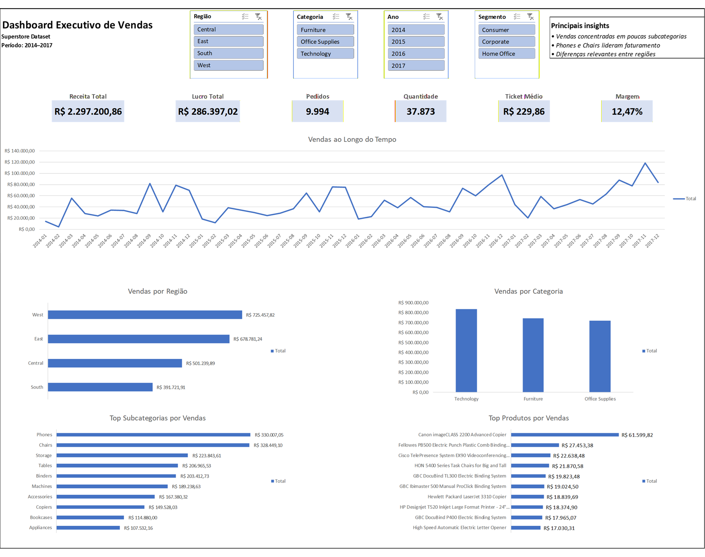
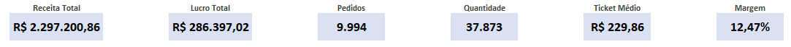
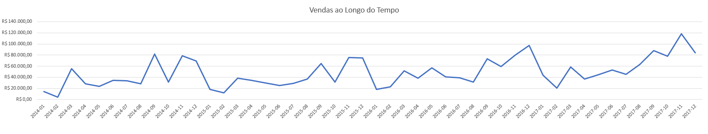
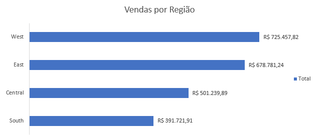
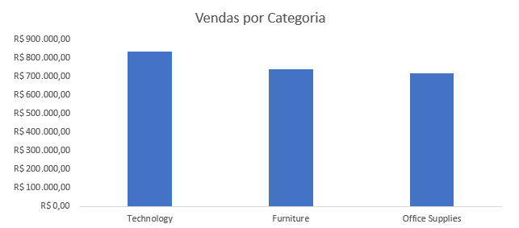
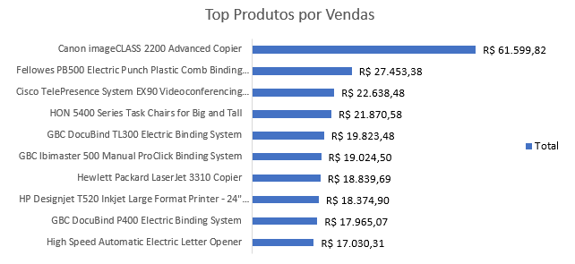

# 📊 Dashboard Executivo de Performance de Vendas — Excel

## 📌 Visão Geral do Projeto

Este projeto apresenta o desenvolvimento de um **Dashboard Executivo de Performance de Vendas em Excel**, criado para transformar dados brutos de vendas em **informações estratégicas para tomada de decisão**.

O objetivo do projeto é demonstrar como um analista de dados pode estruturar um fluxo completo de análise, desde a preparação dos dados até a criação de um **painel executivo de acompanhamento de KPIs**.

Este projeto foi desenvolvido como um **case study de análise de dados**, simulando um cenário real de consultoria analítica.

---

# 🏢 Contexto de Negócio

Uma empresa de varejo / e-commerce possui dados detalhados de vendas, porém não possui uma visão consolidada da performance do negócio.

Gestores enfrentam dificuldades para responder perguntas estratégicas como:

* O negócio está crescendo ao longo do tempo?
* Quais regiões apresentam melhor desempenho?
* Quais categorias geram mais receita?
* Quais produtos geram mais lucro?
* Existem produtos com baixa rentabilidade?

Sem um dashboard estruturado, a análise dessas informações torna-se lenta e pouco eficiente.

---

# 🎯 Problema

Apesar de possuir dados operacionais detalhados, a empresa não possui um **painel de acompanhamento de performance** que permita monitorar os principais indicadores do negócio.

Isso dificulta:

* análise rápida do desempenho das vendas
* identificação de oportunidades de crescimento
* detecção de problemas de rentabilidade

---

# ❓ Pergunta Estratégica

**Como está a performance de vendas da empresa e quais áreas apresentam maior oportunidade de crescimento e rentabilidade?**

---

# 📂 Dataset Utilizado

**Dataset:** Superstore Sales Dataset
**Fonte:** Kaggle

https://www.kaggle.com/datasets/vivek468/superstore-dataset-final

Arquivo utilizado:

Sample - Superstore.csv

Principais campos utilizados na análise:

* Order Date
* Sales
* Profit
* Quantity
* Category
* Sub-Category
* Region
* Segment
* Product Name
* Customer Name

---

# 🧠 Metodologia Analítica

O projeto segue um fluxo estruturado de análise de dados:

Problema de negócio
→ Perguntas estratégicas
→ Hipóteses de análise
→ Análise exploratória
→ Construção do dashboard
→ Identificação de insights

Essa abordagem reflete a metodologia utilizada em projetos reais de **análise de dados e BI**.

---

# 📊 KPIs Monitorados

O dashboard monitora os seguintes indicadores principais:

| KPI                | Descrição                           |
| ------------------ | ----------------------------------- |
| Receita Total      | Soma das vendas                     |
| Lucro Total        | Soma do lucro                       |
| Quantidade Vendida | Total de unidades vendidas          |
| Número de Pedidos  | Total de pedidos                    |
| Ticket Médio       | Receita média por pedido            |
| Margem de Lucro    | Percentual de lucro sobre a receita |

---

# 🏗 Arquitetura Analítica do Projeto

O projeto foi estruturado seguindo uma arquitetura semelhante a projetos de Business Intelligence.

Fluxo analítico:

Dados Brutos
↓
Base Tratada
↓
Modelo de Dados
↓
Análises
↓
Dashboard

Estrutura das abas no Excel:

01_Dados_Brutos
02_Base_Tratada
03_Modelo_Dados
04_Analises
05_Dashboard

Essa estrutura separa claramente as etapas de **dados, transformação, análise e visualização**.

---

# 📈 Dashboard

## Visão Geral do Dashboard

O dashboard apresenta uma visão executiva da performance de vendas, permitindo analisar rapidamente os principais indicadores do negócio.

---

## KPIs Executivos

Os KPIs fornecem uma visão rápida do desempenho geral da empresa.

Eles permitem acompanhar:

* receita total
* lucro total
* volume de vendas
* número de pedidos
* ticket médio
* margem de lucro

---

## Evolução das Vendas ao Longo do Tempo

Esse gráfico permite identificar tendências de crescimento, queda ou sazonalidade nas vendas.

---

## Vendas por Região

A análise regional permite identificar quais regiões apresentam maior participação na receita da empresa.

---

## Vendas por Categoria

Essa análise permite entender quais categorias de produtos geram maior faturamento.

---

## Top Produtos

O ranking de produtos permite identificar quais itens são responsáveis pela maior parte da receita.

---

# 🔎 Principais Insights Identificados

A análise revelou alguns padrões importantes no desempenho do negócio:

### Concentração de vendas

Grande parte da receita está concentrada em **um número reduzido de subcategorias e produtos**.

### Diferenças regionais

Algumas regiões apresentam desempenho significativamente superior em vendas.

### Categorias dominantes

Determinadas categorias representam a maior parcela do faturamento.

### Produtos líderes

Alguns produtos concentram grande parte da receita total, atuando como principais impulsionadores das vendas.

---

# 💡 Recomendações de Negócio

Com base na análise realizada, algumas ações estratégicas podem ser consideradas:

**Foco nos produtos líderes**

Investir em marketing e disponibilidade dos produtos com maior volume de vendas.

**Revisão de produtos com baixa rentabilidade**

Produtos com alto volume de vendas, mas baixa margem, podem exigir revisão de preços ou custos.

**Exploração de regiões com alto potencial**

Regiões com melhor desempenho podem receber investimentos adicionais.

**Diversificação do portfólio**

Reduzir dependência excessiva de poucas subcategorias pode diminuir riscos.

---

# 🛠 Tecnologias Utilizadas

Ferramentas aplicadas neste projeto:

* Microsoft Excel
* Tabelas Dinâmicas
* Gráficos
* Segmentações de Dados
* Limpeza e Transformação de Dados

---

# 📁 Estrutura do Repositório

sales-performance-dashboard-excel

data
└ superstore_sales_dataset.csv

excel
└ sales_dashboard_superstore.xlsx

images
└ dashboard images

README.md

---

# 🚀 Possíveis Extensões do Projeto

Este projeto pode evoluir para análises mais avançadas, como:

* versão do dashboard em Power BI
* automação de atualização de dados com Python
* análise de rentabilidade detalhada
* previsão de vendas

---

# 👨‍💻 Autor

Raphael Guardiano

Projeto desenvolvido como parte do portfólio em **Análise de Dados**, com foco em dashboards executivos e análise de performance de negócios.
