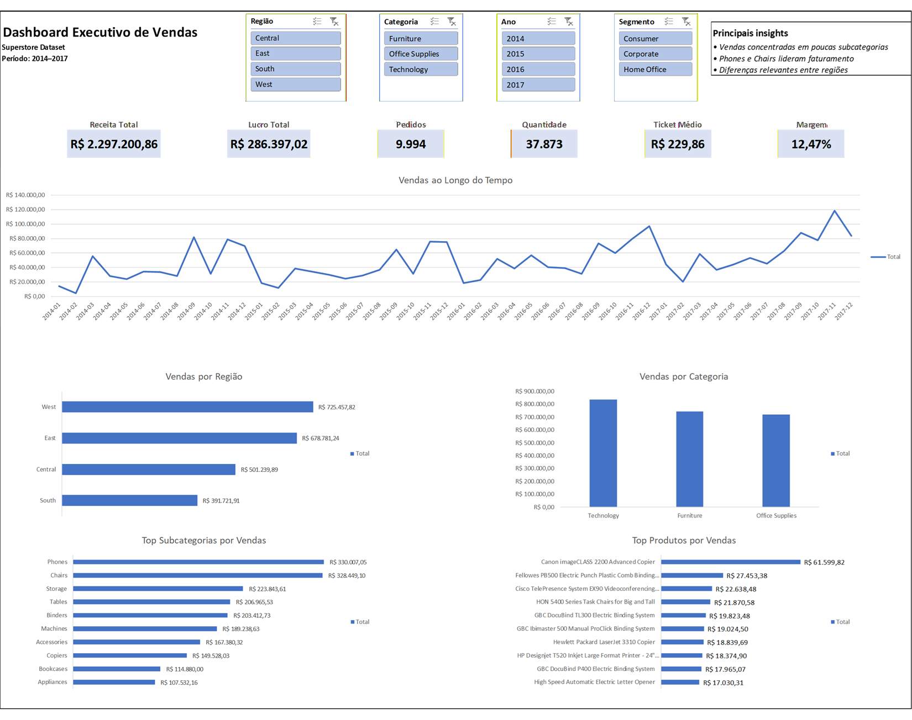
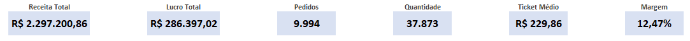
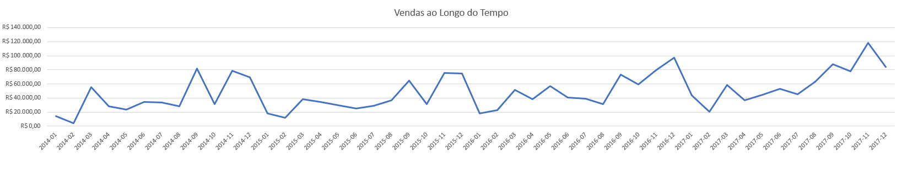
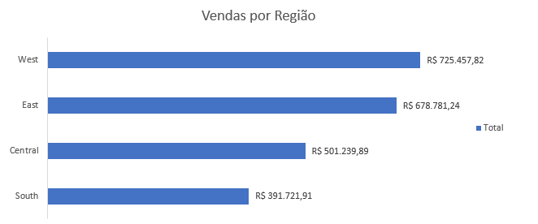
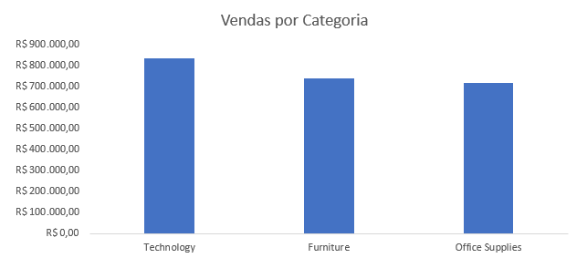
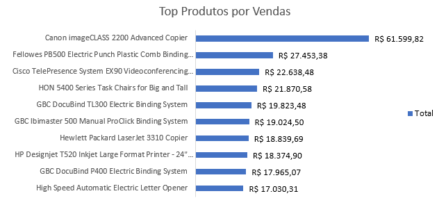

# 📊 Sales Performance Dashboard — Excel

Projeto de análise de dados desenvolvido em Excel para avaliar desempenho de vendas, lucratividade e eficiência por categoria, com foco em transformar dados brutos em indicadores, insights e recomendações práticas de negócio.

---

## 📌 Resumo executivo

Este projeto analisa dados de vendas para entender a relação entre **receita, lucro, margem e desempenho por categoria**.

O principal insight identificado foi que a categoria **Furniture** representa uma parcela relevante da receita, mas contribui proporcionalmente pouco para o lucro, indicando possível problema de margem, descontos, custos ou mix de produtos.

A análise resultou em um dashboard executivo com KPIs de vendas, comparação entre receita e lucro, análise por categoria/região/produto e recomendações práticas para apoiar decisões comerciais.

---

## 🧭 Como visualizar o projeto

* O arquivo principal do dashboard está na pasta `/excel`.
* A base de dados utilizada está na pasta `/data`.
* As imagens do dashboard estão na pasta `/images`.
* O resumo visual do projeto está disponível na seção **Dashboard** deste README.

---

## 📌 Contexto de negócio

Empresas que operam com volume relevante de vendas precisam acompanhar indicadores para entender:

* como está o desempenho geral do negócio;
* quais categorias geram mais receita;
* quais categorias realmente contribuem para o lucro;
* onde existem distorções entre faturamento e rentabilidade.

Sem essa visibilidade, a tomada de decisão tende a ser baseada apenas em volume de vendas, o que pode ocultar problemas importantes de margem e eficiência financeira.

---

## 🎯 Problema de negócio

Empresas que utilizam dados de vendas no Excel frequentemente possuem visibilidade sobre o faturamento, mas nem sempre conseguem identificar com clareza a real lucratividade por categoria, produto ou região.

Essa limitação pode levar a decisões comerciais baseadas apenas em receita, sem considerar quais áreas realmente geram resultado financeiro positivo.

Este projeto foi desenvolvido para investigar essa lacuna, analisando a relação entre **receita, lucro e margem** para identificar distorções de rentabilidade.

---

## ❓ Pergunta de análise

**Como está a performance de vendas da empresa e quais fatores realmente influenciam o resultado financeiro?**

---

## 🧪 Hipóteses de análise

Antes da análise, foram consideradas as seguintes hipóteses:

* Algumas categorias podem apresentar alto volume de vendas, mas baixa eficiência financeira.
* A lucratividade pode não estar distribuída proporcionalmente à receita.
* Existem categorias com maior capacidade de geração de lucro que podem ser priorizadas.
* Parte do faturamento pode estar concentrada em produtos ou subcategorias com menor contribuição para o resultado.

Essas hipóteses orientaram a investigação dos dados e ajudaram a direcionar a análise para a relação entre crescimento de vendas e geração real de valor.

---

## 🗂️ Dataset utilizado

* **Fonte:** Kaggle
* **Arquivo:** `Sample - Superstore.csv`
* **Finalidade:** dataset público utilizado para fins educacionais e composição de portfólio.

Principais campos utilizados na análise:

* `Order Date`
* `Region`
* `Category`
* `Sub-Category`
* `Product Name`
* `Sales`
* `Profit`
* `Quantity`
* `Discount`

> Observação: por se tratar de um dataset público de estudo, os resultados devem ser interpretados como exercício analítico de portfólio, não como diagnóstico de uma empresa real específica.

---

## ⚙️ Metodologia

O projeto foi estruturado nas seguintes etapas:

1. Importação e organização dos dados.
2. Limpeza e padronização da base.
3. Criação de métricas e indicadores.
4. Construção de tabelas dinâmicas.
5. Desenvolvimento do dashboard em Excel.
6. Análise exploratória e diagnóstica.
7. Identificação de insights e recomendações de negócio.

---

## 📈 KPIs monitorados

| KPI                  | Descrição                        |
|----------------------|----------------------------------|
| Receita Total        | Soma total das vendas            |
| Lucro Total          | Soma total do lucro              |
| Número de Pedidos    | Total de pedidos realizados      |
| Quantidade Vendida   | Total de itens vendidos          |
| Ticket Médio         | Receita média por pedido         |
| Margem de Lucro      | Percentual de lucro sobre vendas |

---

# 📊 Dashboard

## Visão Geral

### KPIs

### Vendas ao longo do tempo

### Vendas por região

### Vendas por categoria

### Top produtos

---

## 🔍 Análises realizadas

Além da construção do dashboard, foram realizadas análises para entender melhor o desempenho do negócio:

* análise de receita, lucro e margem;
* comparação entre receita e lucro por categoria;
* participação percentual das categorias no faturamento e no lucro;
* análise de desempenho por região;
* identificação dos produtos com maior volume de vendas;
* análise de concentração por subcategoria.

---

## 💡 Principais insights

A análise revelou padrões relevantes para o negócio:

* A categoria **Technology** apresenta alta eficiência, concentrando aproximadamente **36% da receita** e **51% do lucro**, sendo a principal responsável pelo resultado financeiro.

* A categoria **Office Supplies** apresenta desempenho mais equilibrado entre participação na receita e contribuição para o lucro.

* A categoria **Furniture**, apesar de representar cerca de **32% da receita**, contribui com apenas **6% do lucro**, indicando baixa eficiência econômica.

* Existe um desbalanceamento entre volume de vendas e rentabilidade: parte relevante do faturamento não se converte proporcionalmente em lucro.

* A análise de concentração mostrou que aproximadamente **50% das subcategorias geram mais de 80% da receita**, indicando concentração moderada do faturamento.

---

## 📌 Insight-chave de negócio

A categoria **Furniture** gera uma parcela relevante da receita, mas sua contribuição para o lucro é significativamente baixa.

Isso indica que o crescimento dessa categoria não necessariamente gera valor proporcional para o negócio. O problema não está apenas em vender mais, mas em vender com margem adequada.

Esse achado sugere a necessidade de revisar preços, descontos, custos e mix de produtos para entender por que a categoria apresenta baixa conversão de receita em lucro.

---

## 📌 Recomendações de negócio

### 1. Revisar a estratégia da categoria Furniture

A categoria Furniture apresenta alta participação na receita, mas baixa contribuição para o lucro. Isso indica que vender mais nessa categoria não necessariamente melhora o resultado financeiro do negócio.

* **Ação recomendada:** reavaliar preços, descontos, custos e estratégia comercial da categoria.
* **Justificativa baseada nos dados:** alta receita com baixa lucratividade proporcional.
* **Impacto esperado:** aumento da margem geral sem depender apenas do crescimento do volume de vendas.

### 2. Priorizar categorias com maior eficiência financeira

A categoria Technology se destacou tanto em receita quanto em lucro, demonstrando maior eficiência financeira em comparação com as demais.

* **Ação recomendada:** priorizar ações comerciais voltadas para categorias e produtos com maior contribuição para o lucro.
* **Justificativa baseada nos dados:** alta participação em receita e forte contribuição para o resultado financeiro.
* **Impacto esperado:** crescimento mais sustentável, com melhor retorno sobre as vendas.

### 3. Reavaliar o mix de produtos dentro de Furniture

O baixo retorno da categoria Furniture sugere que parte dos produtos ou subcategorias pode estar comprometendo a rentabilidade.

* **Ação recomendada:** identificar produtos com baixa margem, alto desconto ou baixa contribuição para o lucro.
* **Justificativa baseada nos dados:** a categoria gera receita, mas não converte esse volume em lucro na mesma proporção.
* **Impacto esperado:** melhoria da eficiência da categoria e redução de distorções de rentabilidade.

---

## 🧠 Aprendizados do projeto

Durante o desenvolvimento deste projeto, foram trabalhados conceitos importantes de análise de dados aplicada a negócios:

* estruturação de problema de negócio;
* análise de desempenho comercial;
* criação e interpretação de KPIs;
* análise de margem e eficiência financeira;
* comparação entre métricas de receita e lucro;
* construção de dashboard em Excel;
* transformação de dados em recomendações práticas.

---

## 💼 Aplicação como serviço

Este projeto representa um tipo de análise que pode ser aplicado em empresas que utilizam Excel no dia a dia para acompanhar vendas, produtos e resultados financeiros.

### Para quem é

* Pequenas e médias empresas.
* E-commerces.
* Negócios que utilizam planilhas para controle de vendas.
* Empresas que precisam entender melhor a relação entre faturamento e lucratividade.

### Problemas que resolve

* Falta de clareza sobre quais produtos ou categorias realmente geram lucro.
* Decisões baseadas apenas em volume de vendas.
* Dificuldade em identificar distorções de rentabilidade.
* Ausência de indicadores consolidados para acompanhamento comercial.

### Tipo de entrega

* Dashboard de vendas em Excel.
* Análise de lucratividade por categoria e produto.
* Identificação de oportunidades de melhoria.
* Recomendações práticas para tomada de decisão.

---

## 📌 Conclusão

Este projeto demonstra como dados de vendas podem ser utilizados não apenas para visualizar resultados, mas para orientar decisões de negócio.

A análise evidenciou que categorias com alto volume de receita nem sempre contribuem proporcionalmente para o lucro, reforçando a importância de avaliar eficiência financeira e não apenas faturamento.

O principal aprendizado foi que um dashboard se torna mais útil quando conecta indicadores, contexto de negócio e recomendações práticas.

---

## 📎 Sobre o projeto

Este projeto faz parte da minha transição de carreira para a área de Análise de Dados.

Estou desenvolvendo projetos práticos com foco em:

* análise de dados aplicada a negócios;
* construção de dashboards;
* criação e acompanhamento de KPIs;
* diagnóstico de desempenho;
* automação de relatórios;
* geração de insights e recomendações práticas.
